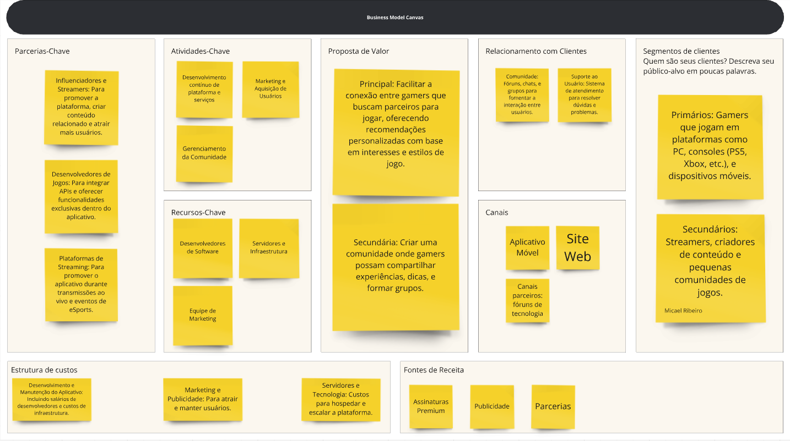

# Business Model Canvas

## Proposta de Valor

- **Principal**: Facilitar a conexão entre gamers que buscam parceiros para jogar, oferecendo recomendações personalizadas com base em interesses e estilos de jogo.
- **Secundária**: Possibilitar desenvolvedores de jogos criem comunidades e se aproximem dos usuários de seus jogos.

## Segmentos de Clientes

- **Primários**: Gamers que jogam em plataformas como dispositivos móveis ou PC, consoles (PS5, Xbox, etc.).
- **Secundários**: Desenvolvedores de jogos para diversas plataformas.
- **Terciários**: Streamers, criadores de conteúdo e pequenas comunidades de jogos.

## Canais

- **Aplicativo Móvel**: A principal plataforma onde os usuários irão se conectar e interagir.
- **Site Web**: Para informações adicionais, suporte ao usuário e integração com o aplicativo.
- **Redes Sociais**: Para promover o aplicativo e engajar a comunidade.

## Relacionamento com Clientes

- **Comunidade**: Chats e grupos para fomentar a interação entre usuários.
- **Suporte ao Usuário**: Sistema de atendimento para resolver dúvidas e problemas.

## Fontes de Receita

- **Assinaturas Premium**: Recursos exclusivos, como matchmaking avançado e ausência de anúncios.
- **Publicidade**: Exibição de anúncios relacionados a jogos, acessórios e eventos de eSports.
- **Parcerias**: Promoções conjuntas com empresas de jogos, hardware e eventos de eSports.

## Recursos-Chave

- **Desenvolvedores de Software**: Para construir e manter o aplicativo.
- **Servidores e Infraestrutura**: Para garantir que o aplicativo funcione sem problemas, mesmo com muitos usuários.
- **Equipe de Marketing**: Para atrair usuários e construir a comunidade.

## Atividades-Chave

- **Desenvolvimento de Software**: Criação e atualização do aplicativo e do algoritmo de matchmaking.
- **Marketing e Aquisição de Usuários**: Campanhas para atrair gamers para a plataforma.
- **Gerenciamento da Comunidade**: Moderação e engajamento da comunidade para manter um ambiente positivo.

## Parcerias-Chave

- **Influenciadores e Streamers**: Para promover a plataforma, criar conteúdo relacionado e atrair mais usuários.
- **Desenvolvedores de Jogos**: Para integrar APIs e oferecer funcionalidades exclusivas dentro do aplicativo.
- **Plataformas de Streaming**: Para promover o aplicativo durante transmissões ao vivo e eventos de eSports.

## Estrutura de Custos

- **Desenvolvimento e Manutenção do Aplicativo**: Incluindo salários de desenvolvedores e custos de infraestrutura.
- **Marketing e Publicidade**: Para atrair e manter usuários.
- **Servidores e Tecnologia**: Custos para hospedar e escalar a plataforma.

